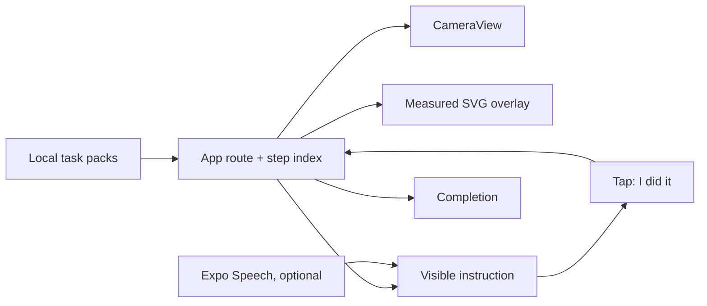

# Ori — hackathon PRD and stage plan

**Status:** implemented stage-path specification  
**Product:** Ori (repository: Birdseye)  
**Decision:** camera-guided, fixed-workspace learning; no AR anchoring, camera-based verification, or OpenAI Realtime dependency.

## Executive decision

Ori puts the *next physical action* on a real task. The hackathon build shows a phone fixed above a paper workspace, amber fold lines and green direction arrows over the live camera view, a one-sentence guide, and an explicit learner confirmation to continue.

This is intentionally **screen-space guidance**. The paper must stay inside the visible placement frame; the app does not know whether a fold was made or track the paper when the rig moves. This is both feasible in two hours and far more stage-reliable than trying to imitate AR.

### Positioning

> **Ori makes the next move obvious.**

Supporting line: *Learn by doing, in the real world.*

Say “camera-guided visual instruction,” not “world-anchored AR.” Say “guided completion” or “self-confirmed,” not “AI-verified.”

## User and job

**Primary user:** a beginner whose hands are occupied by a short physical task.

**Job to be done:** When I am doing an unfamiliar practical task, I want the next action shown on the task and stated briefly, so I can proceed confidently without repeatedly translating instructions.

## Goals

- Show a live, top-down camera surface in under ten seconds.
- Guide one short task with a single action and overlay at a time.
- Always retain an obvious tap path; device speech is helpful but never required.
- Demonstrate that the content engine can serve more than one task pack.
- Finish in a clear, honest completion state.

## Non-goals

- SLAM, ARKit/ARCore, feature tracking, pose estimation, and 3D models.
- Live fold recognition or an AI completion score.
- OpenAI Realtime, microphone keyword detection, login, saving, sharing, curriculum generation, social matching, or a backend.
- Advice for dangerous tasks involving heat, blades, power, or food allergies.

## MVP experience

### Home

- An Ori folded-paper mark and “Make the next move obvious.”
- Three local lesson cards: Paper Crane, Paper Airplane, and Napkin Rose.
- Paper Crane is visually primary; the others prove the reusable pack format.

### Guide

- Full-screen back-camera preview in portrait orientation.
- A dotted paper-placement frame and one animated step overlay.
- Amber dashed lines and outlines indicate a crease; green arrows indicate movement.
- A compact header exposes task, progress, and exit.
- The bottom voice card displays the instruction, replay control, voice toggle, and `I did it` primary action.
- Coordinates are normalized in local pack data and multiplied by the measured view size. They are not tied to detected physical objects.

### Completion

- A celebration, task reference, completed move count, and `SELF-CONFIRMED` label.
- `Learn something new` returns to Home.

## Functional requirements and acceptance checks

| Requirement | Acceptance check |
|---|---|
| Local lesson data | Every Home card opens the correct title, step count, narration, and overlay. |
| Camera resilience | Permission state explains the request; a mount error keeps visible guidance and says to restart before presenting. |
| Scaled overlays | SVG receives its own viewport dimensions from `onLayout`; no global-screen coordinate assumptions. |
| Accessibility | Text instruction is always visible; primary action has a descriptive label and is at least 48 px high. |
| No network dependency | A full lesson runs with airplane mode enabled and no API key. |
| Truthful completion | Completion language attributes progress to the learner’s confirmations, not camera judgement. |
| Stable end-to-end flow | Home → Guide → Done → Home works repeatedly without a reload. |

## Technical approach

| Layer | Choice | Why |
|---|---|---|
| Camera | `expo-camera` / `CameraView` | Live physical context with a simple permission path. |
| Graphics | `react-native-svg` | Deterministic dashed guides, polygons, and arrows over the same viewport. |
| Voice | `expo-speech` | Offline device narration; can be disabled without affecting the flow. |
| State | Local React state | Three screens need no navigation library, server, or database. |
| Content | Typed local task packs | Reliable and easy to extend during a demo. |

Do not include a secret in the mobile app. A production Realtime integration would require a server-created ephemeral credential and a native/WebRTC decision; it is not part of the stage path.

## Visual direction

- Dark charcoal stage: `#10151A`.
- Amber action/fold guide: `#F5B544`.
- Green directional/confirmed state: `#37D67A`.
- Off-white text: `#FFF9EA`.
- One deliberate signature: the folded-paper Ori mark and a persistent dotted physical placement frame. The rest of the interface stays quiet so the real object remains the focus.

## Two-hour plan

| Time | Work | Exit condition |
|---:|---|---|
| 0:00–0:15 | Project, routes, local packs | Home → placeholder guide → completion works. |
| 0:15–0:45 | Camera and SVG coordinate system | A diagonal lands across the physical paper on the exact demo phone. |
| 0:45–1:05 | Step progression, voice bar, completion | Crane completes locally with the tap control. |
| 1:05–1:20 | Optional device TTS | Removing/muting speech does not break completion. |
| 1:20–1:40 | Mount calibration and three rehearsals | Full camera path succeeds three times. |
| 1:40–2:00 | Record fallback and freeze | Only crash, visibility, and progression bugs may be fixed. |

## Demo choreography

1. “Knowing the steps is not the same as being able to do them. Ori puts the next action on the task.”
2. Tap Paper Crane and show the live paper inside the placement frame.
3. Demonstrate a guide line, a directional arrow, and a visible `I did it` transition. Fold only three clearly visible moves if time is tight.
4. Reach completion, return Home, and open another card only long enough to show that it changes the lesson content.
5. Close with: “This is a reliable first layer—fixed-workspace visual guidance. Perception and adaptive placement come next.”

## Stage checklist

- [ ] A phone mount places the camera about 30 cm above a taped or marked paper area.
- [ ] Phone is locked to portrait, sufficiently charged, and not in Silent Mode if speech will be used.
- [ ] Camera permission is granted before the presentation.
- [ ] The audience sees a mirrored phone screen or recorded close-up, not only a phone held in the presenter’s hand.
- [ ] The exact Paper Crane flow has passed three rehearsals.
- [ ] A complete, locally playable screen recording is ready as fallback.
- [ ] If live voice fails, the presenter taps `I did it`; do not troubleshoot on stage.

## Follow-on roadmap

1. Supported-surface calibration and computer-vision confidence prompts.
2. Expert authoring workflow for validated task packs.
3. Adaptive guidance grounded in detected task state.
4. Saved paths, reflection, and optional proof—never a fabricated verification score.
5. Personas, community, and hardware integrations only after the execution loop measurably improves completion.
